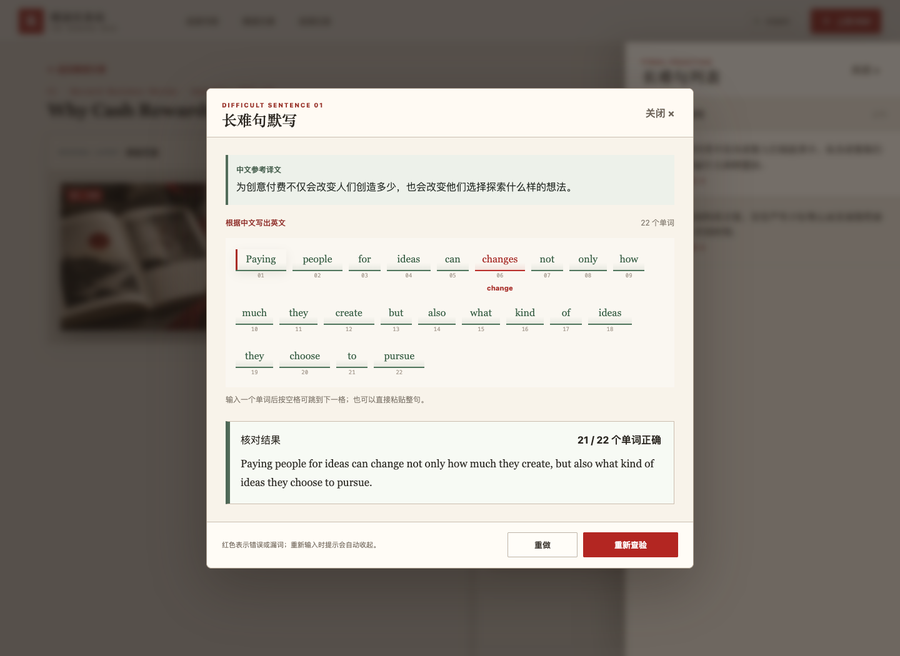

# 精读任务站（reading-request）

一个面向个人英语阅读训练的浏览器应用。你可以上传英文期刊或杂志 PDF，也可以通过网址导入公开英文文章；选取正文后，把它转换成逐句精读材料，随后完成翻译、词汇查询、长难句标记、默写练习和番茄专注。

- 在线使用：[https://hellxeggplant.github.io/reading-request/](https://hellxeggplant.github.io/reading-request/)
- GitHub 仓库：[https://github.com/HellxEggplant/reading-request](https://github.com/HellxEggplant/reading-request)
- 数据模式：浏览器本地存储，无账号、无云端数据库

> 重要：PDF、文章和学习记录只保存在当前设备的当前浏览器中。第一次使用后，请及时在“阅读书库”中导出整库备份。


_截图中的文档和文章是功能演示数据。_

## 目录

- [快速开始](#快速开始)
- [功能总览](#功能总览)
- [一、阅读书库](#一阅读书库)
- [二、从 PDF 框选文章](#二从-pdf-框选文章)
- [三、从网页选择文章](#三从网页选择文章)
- [四、精读文章](#四精读文章)
- [五、逐句精读](#五逐句精读)
- [六、词典与生词](#六词典与生词)
- [七、中文翻译与参考译文](#七中文翻译与参考译文)
- [八、长难句默写](#八长难句默写)
- [九、阅读记录](#九阅读记录)
- [数据保存、备份与换电脑](#数据保存备份与换电脑)
- [离线能力与隐私](#离线能力与隐私)
- [当前限制](#当前限制)
- [本地运行与开发](#本地运行与开发)
- [项目结构与第三方服务](#项目结构与第三方服务)

## 快速开始

1. 使用较新版本的 Chrome 或 Safari 打开[精读任务站](https://hellxeggplant.github.io/reading-request/)。
2. 点击右上角“上传资料”，选择“上传 PDF”导入期刊杂志，或选择“文章网址”粘贴公开文章链接。
3. PDF：在书库中点击“打开并框选文章”，翻到目标页面并按阅读顺序框选正文。
4. 网页：载入清爽阅读版，选中文字并点击“加入选中文字”；可分多次选取。
5. 检查选区文字，填写文章标题和 CEFR 难度，然后点击“生成逐句精读”。
6. 进入“精读文章”，选择文章并点击“继续精读”。
7. 逐句填写中文翻译与笔记，点击单词查询释义或将句子标为长难句。
8. 从右侧“长难句默写”进入默写练习；结束后点击“完成本次精读”。
9. 回到“阅读书库”，点击“导出整库备份”保存数据副本。

## 功能总览

| 模块 | 主要用途 | 常用操作 |
| --- | --- | --- |
| 阅读书库 | 管理 PDF 材料 | 上传、搜索、收藏、排序、重命名、下载、删除、备份与恢复 |
| PDF 框选 | 从杂志版面提取文章 | 翻页、缩放、全屏框选、多区域排序、校正文稿、生成精读文章 |
| 网页导入 | 从公开网页提取文章 | 粘贴链接、清爽阅读、选择文字、调整选区、手动粘贴备用 |
| 精读文章 | 管理已提取的文章 | 查看原版、修改标题/难度/正文、继续精读 |
| 逐句精读 | 按句学习文章 | 前后翻句、翻译、笔记、校正文句、生词和长难句标记、番茄专注 |
| 词典 | 理解并积累词汇 | ECDICT 中英释义、Datamuse 英英释义、发音、自定义中文笔记 |
| 参考译文 | 核对自己的翻译 | 在线生成、展开对照、编辑与保存参考译文 |
| 长难句默写 | 中文提示下还原英文原句 | 逐词输入、查验、纠错、重新查验、重做 |
| 阅读记录 | 查看个人学习成长 | 每日文章、翻译/词汇/长难句提升、连续阅读、近 7 天进步、CEFR 分布 |

## 一、阅读书库

阅读书库是所有 PDF 材料的入口。点击顶部“上传 PDF”或书库末尾的添加卡片即可导入文件，也可以把 PDF 直接拖入页面。

### 上传后会发生什么

- 网站验证文件是否为 PDF。
- 使用内置 PDF.js 读取文件页数。
- 自动截取第一页作为杂志封面缩略图。
- 原始 PDF 保存在浏览器本地，不会上传到 GitHub。

### 查找与整理材料

- **搜索**：按杂志名称或 PDF 文件名搜索。
- **排序**：可按最近添加、名称或页数排序。
- **只看收藏**：点击封面上的收藏图标，再开启“只看收藏”筛选。
- **重命名**：修改书库中的显示名称；与该 PDF 关联的文章来源名也会同步更新。
- **下载**：把浏览器中保存的原始 PDF 下载回电脑。
- **删除**：删除 PDF 时可选择是否同时删除由它生成的精读文章。若不勾选，文章仍会保留。

### 备份与恢复

- **导出整库备份**：生成一个 JSON 文件，包含 PDF、精读文章、翻译、笔记、词汇和练习记录。
- **恢复整库备份**：选择之前导出的 JSON 文件。相同 ID 的内容会更新，不同 ID 的内容会合并进当前书库。
- 备份中包含 PDF 数据，文件可能较大，请妥善保存。

## 二、从 PDF 框选文章

点击某本文档的“打开并框选文章”进入选区页面。这个步骤保留原杂志版面，同时提取可用于逐句学习的文字。

### 页面浏览

- 使用“上一页”“下一页”或输入页码跳转。
- 开启“全屏框选”后，可使用缩小、适合页面和放大按钮，让整页处于更方便的选择尺寸。
- PDF 页数较多时仍可在同一界面连续翻页，已经加入文章的选区不会因翻页丢失。

### 框选文章

1. 在 PDF 页面上按住鼠标并拖出矩形。
2. 松开后，选区的页码、截图和识别文字会加入右侧列表。
3. 多栏文章建议先框左栏、再框右栏；系统会按照选区在列表中的顺序组合正文。
4. 使用上移、下移调整阅读顺序，或删除错误选区。
5. 如需重来，点击“清除全部框选”。

### 校正与生成

- 填写文章标题，并选择 A1–C2 的 CEFR 难度。
- 每个选区的识别文字都可以直接编辑，适合修正断行、连字符、页眉页脚或识别错误。
- 点击“生成逐句精读”后，网站会保存选区截图、合并文字并自动拆分英文句子。

> 扫描版或纯图片 PDF 暂不支持 OCR。如果选区没有提取出文字，可以把正确文字手动粘贴到右侧文本框后再生成。

## 三、从网页选择文章

点击顶部“上传资料 → 文章网址”或书库中的“添加网页”，即可通过网址导入公开英文文章。

### 自动读取与选择正文

1. 粘贴完整的 `http://` 或 `https://` 文章地址。
2. 点击“读取网页”。网站会先尝试直接读取；如果目标站限制跨域访问，则切换到 Jina Reader 清爽阅读服务。
3. 文章载入后，在左侧阅读版中用鼠标选中需要精读的英文内容。
4. 点击“加入选中文字”。可重复选择多个段落，加入顺序就是最终正文顺序。
5. 在右侧修改选区文字、调整前后顺序或删除无关内容。
6. 填写标题和 CEFR 难度，点击“生成逐句精读”。

清爽阅读版会移除网页脚本、导航和大部分无关内容，只以纯文本显示。网站不会执行来源页面中的脚本。

### 无法读取时

登录页面、付费文章、动态加载页面或禁止外部读取的网站可能无法自动导入。此时可以：

1. 点击“打开原网页”，在新页面复制需要的英文正文。
2. 回到精读任务站，点击“手动粘贴正文”。
3. 把正文粘贴到输入区；选中一部分后加入，或不选内容直接加入全部正文。

> 点击“读取网页”会把你输入的公开网址发送给 Jina Reader，但不会发送 PDF、翻译、笔记或学习记录。请遵守来源网站的版权和使用规则，不要尝试绕过登录或付费限制。

## 四、精读文章

“精读文章”以紧凑记录形式列出已经生成的文章，显示 CEFR 难度、来源、句子数、生词数和完成进度。


### 查看原文

- 点击一条记录的空白区域，即可选中该文章并弹出原文预览。
- 预览中会显示生成文章时保存的原版选区图片和完整提取文字。
- 不需要额外的“查看原文”按钮。

### 编辑文章

点击记录上的“编辑”，可以修改：

- 文章标题；
- CEFR 难度；
- 完整英文正文。

保存时网站会重新拆分句子。如果句子数量没有变化，翻译和笔记会尽量按原顺序保留；如果正文变化较大，系统会尝试按原句匹配，新增句子则从空白学习记录开始。

### 继续精读

点击“继续精读”进入逐句阅读页。进度按照已经填写中文翻译的句子比例计算。

## 五、逐句精读

逐句精读采用“原版页面 + 句子卡片”的布局：左侧用于核对杂志版面，右侧一次专注学习一句。


### 调整阅读区域

- 拖动中间分隔线可以调整左右区域宽度。
- 聚焦分隔线后，也可使用键盘左右方向键微调。
- 点击“放大查看”可在弹窗中查看完整原版选区。

### 切换句子

- 使用“上一句”“下一句”按钮切换卡片。
- 光标不在输入框中时，可使用键盘 `←`、`→` 切换。
- 顶部显示当前句序和整篇完成进度。

### 每一句可以做什么

- 阅读英文原句；
- 填写自己的中文翻译；
- 记录语法分析、句子结构或理解笔记；
- 点击英文单词查询释义并标记生词；
- 标记或取消标记长难句；
- 展开“参考译文”进行核对；
- 点击“校对识别文字”修正原句。

如果文章漏了一句，可以使用添加句子功能补充。点击“保存”会写入当前浏览器；点击“完成本次精读”会保存并把该文章记为已完成。

### 番茄时钟

精读页面提供一个可爱的像素番茄悬浮时钟：

- 专注阶段默认 25 分钟，完成后进入 5 分钟休息阶段。
- 点击“开始”倒计时，点击“暂停”保留剩余时间，点击“重置”恢复当前阶段的完整时间。
- 倒计时期间，浏览器标签标题会同步显示剩余时间。
- 鼠标悬浮或点击番茄，会展开计时控制、计时进度和番茄工作法介绍；鼠标移开或开始计时后自动收起，手机端直接点击即可。
- 按住番茄即可拖到页面任意位置；位置会保存在当前浏览器，下次打开时继续沿用。
- 阶段结束后会出现站内提示；下一阶段由使用者手动开始。

## 六、词典与生词

点击原句中的英文单词，会同时完成两件事：把它加入本篇生词，并打开词义详情弹窗。

### 词义详情包含

- 单词和音标；
- 浏览器语音合成发音；
- ECDICT 本地中英释义；
- Datamuse 在线英英释义与相关词；
- ECDICT 可提供时的词频、考试标签和词形变化；
- 可编辑、保存的“我的中文笔记”。

已经标记的词会显示在句子下方的生词栏。点击词旁的“×”可以取消标记；点击词本身可以再次打开详情。查询结果和个人笔记会跟随文章保存在本地。

> ECDICT 词库按常用词拆分为静态数据文件；Datamuse 查询需要联网。个别专有名词、新词或变形词可能没有完整释义。

## 七、中文翻译与参考译文

每张句子卡片都提供一个中文翻译输入框。建议先独立完成自己的翻译，再展开“参考译文”核对。

### 生成参考译文

1. 展开当前句子的“参考译文”。
2. 默认使用 MyMemory；也可以点击参考译文框下方的齿轮，在“翻译模型设置”中切换到 OpenAI API，并填写自己的 API 密钥。
3. 同意后生成英译中参考文本。
4. 参考译文可以编辑、保存，也可以重新生成。

MyMemory 只接收当前英文句子。选择 OpenAI 时，只发送当前英文句子和文章标题，不发送完整 PDF、中文翻译、个人笔记、生词或整篇文章。API 密钥仅保留在当前浏览器标签页，关闭标签页后自动清除，不会进入 GitHub 或书库备份。MyMemory 单次请求存在 500 字节限制；AI 译文与机器译文都仅用于核对，不应视为唯一标准答案。

## 八、长难句默写

把句子标记为长难句后，页面会短暂提示“长难句默写练习在右边侧边栏”。提示三秒后自动关闭，也可以点击侧栏关闭；选择“不再提示”后，当前浏览器不再显示该引导。

### 打开练习

1. 点击页面右侧竖排的“长难句默写”。
2. 侧边抽屉只显示已标记的长难句列表。
3. 选择一个句子，打开独立的默写练习弹窗。



### 练习方式

- 上方显示中文参考译文。
- 下方按照英文原句的单词数量提供输入线段，每个线段对应一个英文单词。
- 输入空格会跳到下一个词，也可以粘贴整句自动分配到各输入格。
- 点击“查验标准原文”后，正确词显示绿色，错误词显示红色并在下方提示正确单词。
- 结果区显示正确词数、总词数和标准原句。
- 查验后点击或输入任意单词格，旧的颜色和结果提示会自动消失，方便继续修改。
- **重新查验**：保留当前答案，再次检查修改结果。
- **重做**：清空所有输入和反馈，并把焦点移回第一个单词格。

查验时忽略英文大小写，并统一处理弯引号和直引号；标点符号不会单独占用输入格。

## 九、阅读记录

“阅读记录”不只汇总总量，还会把学习行为按日期组织起来：

- 有效阅读天数和连续阅读天数；
- 已完成精读文章数；
- 已填写中文翻译的句子数；
- 已标记的不重复生词数；
- 最近 7 天新增的翻译和生词；
- 每天学习过的文章、当前完成比例和具体练习成果；
- 每天新增的翻译、笔记、生词、长难句和默写练习；
- A1–C2 各难度文章的分布。

旧版本已经存在的文章会按最后更新时间生成一条“历史数据补录”。新版本会在保存精读、切换句子、标记生词或长难句、完成默写查验时更新当天记录，因此之后的每日变化会更准确。

## 数据保存、备份与换电脑

### 数据保存在哪里

- PDF、文章、翻译、笔记、词汇、完成状态和每日成长记录保存在浏览器的 IndexedDB 中。
- 引导提示、翻译服务和模型选择等轻量设置保存在 localStorage 中；OpenAI API 密钥只临时保存在 sessionStorage 中。
- GitHub Pages 只托管程序代码、界面资源和静态词典文件，不保存你的阅读资料。

### 为什么换浏览器后看不到数据

每台设备、每个浏览器、每个浏览器用户配置都有独立的本地存储。例如，Chrome 中上传的材料不会自动出现在 Safari 中；`localhost` 的数据也不会自动出现在 GitHub Pages 网站中。

### 换电脑或换浏览器

1. 在旧环境的“阅读书库”点击“导出整库备份”。
2. 把导出的 JSON 文件复制到新电脑。
3. 在新环境打开精读任务站。
4. 点击“恢复整库备份”并选择该文件。
5. 检查 PDF、文章和阅读记录是否齐全后，再决定是否清理旧设备数据。

> 清除浏览器网站数据、使用无痕模式或重置浏览器配置，可能导致本地记录丢失。请定期导出备份。

## 离线能力与隐私

- 首次在线打开后，Service Worker 会缓存应用外壳、PDF.js 和已访问的静态资源，核心阅读功能可在断网时继续使用。
- 已加载过的 ECDICT 数据分片可继续使用；尚未缓存的分片可能需要恢复网络后加载。
- Datamuse 词典、MyMemory 和 OpenAI 参考翻译都是在线服务，断网时不可用。
- 网址自动导入需要访问来源网站或 Jina Reader；已经保存的网页精读文章可离线继续学习。
- 应用没有账号系统，也不会把 PDF 或学习记录上传到项目服务器。
- 如果你不同意发送当前句子给 MyMemory，可以跳过在线参考译文并手动填写。

## 当前限制

- 暂无扫描 PDF 的 OCR；纯图片页面需手动粘贴文字。
- 自动拆句和 PDF 文本提取可能受多栏、脚注、断词或特殊字体影响，请在生成前校正。
- 参考译文和词典结果来自第三方数据，可能存在遗漏或错误。
- 没有云端同步、多人协作或账户恢复；跨设备依赖手动备份。
- Safari 和 Chrome 的本地数据彼此独立。
- 登录墙、付费墙或明确禁止读取的网页不能自动导入，也不会尝试绕过限制。

## 本地运行与开发

需要较新版本的 Node.js，推荐 Node.js 22 或更高版本。

```bash
git clone https://github.com/HellxEggplant/reading-request.git
cd reading-request
npm install
npm start
```

然后打开 [http://localhost:3000](http://localhost:3000)。

### 更新静态词典

仓库不包含完整的 ECDICT SQLite 原始库。如果需要重新生成浏览器使用的词典分片，请先把数据库放到 `data/ecdict.sqlite`，再运行：

```bash
npm run build:dictionary
```

### 发布

推送到 `main` 分支后，`.github/workflows/pages.yml` 会通过 GitHub Actions 自动发布 GitHub Pages。用户数据不参与构建，也不会随发布上传。

## 项目结构与第三方服务

```text
.
├── index.html                 # 页面结构
├── styles.css                # 响应式界面样式
├── app.js                    # 书库、精读、词典和练习逻辑
├── sw.js                     # 离线缓存
├── vendor/                   # PDF.js 等本地依赖
├── data/ecdict/              # 浏览器端 ECDICT 静态分片
├── scripts/                  # 词典构建脚本
├── docs/images/              # README 截图
└── .github/workflows/        # GitHub Pages 发布流程
```

项目使用或连接以下资源：

- [PDF.js](https://mozilla.github.io/pdf.js/)：浏览器内读取和渲染 PDF。
- [ECDICT](https://github.com/skywind3000/ECDICT)：本地中英词典数据。
- [Datamuse API](https://www.datamuse.com/api/)：在线英文释义和相关词。
- [MyMemory API](https://mymemory.translated.net/doc/spec.php)：在线生成英译中参考文本。
- [Jina Reader](https://jina.ai/reader/)：把公开网页转换为可选择的清爽文本。

第三方查询服务的可用性、速率限制和返回质量由各服务提供方决定。
